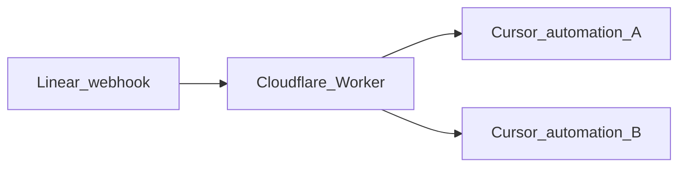

# Linear → Cursor webhook router

A **Cloudflare Worker** sits between **Linear** and **Cursor**. Linear sends *one* webhook to this Worker; the Worker verifies the request, decides which **rules** match (status change, new issue, comment, emoji, etc.), and **POSTs JSON** to the right **Cursor webhook URL** for each matching automation—so Cursor only runs the automations you care about instead of every broad Linear trigger.

**Ingress URL (after deploy):** `POST https://<your-worker-host>/webhooks/linear`

---

## How the pieces connect

1. **Linear** — fires HTTPS `POST` to your Worker when issues/comments/reactions (etc.) change, using Linear’s signing secret.
2. **Cloudflare Worker** — checks the signature, parses the event, runs `[src/routing/rules.ts](src/routing/rules.ts)`, then `fetch`es each matching **Cursor** URL stored in **environment variables**.
3. **Cursor** — each automation exposes its own **incoming webhook URL**; you paste that URL into Cloudflare as the value of a `CURSOR_WEBHOOK_`* variable.




---

## 1. Cloudflare

### 1.1 Deploy the Worker

From this repo:

```bash
npm install
npx wrangler login
npx wrangler deploy
```

Note the **Worker URL** (e.g. `https://cursor-linear-webhooks-issues.<your-subdomain>.workers.dev` or your **Custom Domain**). Your Linear webhook will be:

```text
https://<worker-host>/webhooks/linear
```

### 1.2 Set the Linear signing secret (required)

Linear signs every webhook; the Worker rejects requests without a valid signature.

**Option A — Wrangler CLI**

```bash
npx wrangler secret put LINEAR_WEBHOOK_SECRET
```

Paste the **signing secret** from Linear (see [Linear (section 2)](#2-linear) below). This value is **encrypted** and not visible in the dashboard as plain text.

**Option B — Dashboard**

**Workers & Pages** → your Worker → **Settings** → **Variables and Secrets** → **Add** → type **Secret** → name `LINEAR_WEBHOOK_SECRET`.

### 1.3 Set Cursor destination URLs and auth tokens (per automation)

Each automation can use:

- one **URL variable** (`CURSOR_WEBHOOK_`*) with the incoming Cursor HTTPS webhook URL.
- one optional **secret token variable** (`CURSOR_WEBHOOK_*_AUTH_TOKEN`) used as `Authorization: Bearer <token>` on outbound dispatches.


| Where to set                                                                                                       | Use case                                                                                                                                    |
| ------------------------------------------------------------------------------------------------------------------ | ------------------------------------------------------------------------------------------------------------------------------------------- |
| **Dashboard** → Worker → **Settings** → **Variables and Secrets** → **Add variable** (type **Plaintext** for URLs) | Production / staging URL values                                                                                                             |
| **Dashboard**/**Wrangler** → add **Secret** for `CURSOR_WEBHOOK_*_AUTH_TOKEN`                                      | Production / staging auth tokens                                                                                                            |
| `**wrangler.jsonc`** top-level `"vars": { ... }`                                                                   | Non-secret defaults (URLs and test-only values; do not store real auth tokens in git)                                                       |
| `**.dev.vars`** (local only, gitignored)                                                                           | `npm run dev` local URLs and local auth tokens — [Wrangler docs](https://developers.cloudflare.com/workers/wrangler/configuration/#secrets) |


**Naming:** Variable names are fixed in `[src/routing/rules.ts](src/routing/rules.ts)`:

- `targetEnvKey` points to the destination URL variable.
- `authTokenEnvKey` (optional) points to the auth token secret variable.

If the URL variable is **missing** or **empty**, that rule is skipped.
If an auth token variable is **missing** or **empty**, dispatch still proceeds **without** an `Authorization` header (fail-open) and logs a warning.

### 1.4 Optional: replay window


| Variable                  | Default | Purpose                                                                                                                          |
| ------------------------- | ------- | -------------------------------------------------------------------------------------------------------------------------------- |
| `LINEAR_REPLAY_WINDOW_MS` | `60000` | Reject webhooks whose `webhookTimestamp` is older than this many ms (replay protection). Set as a **plain** var if you override. |


### 1.5 After changing bindings or `vars` in `wrangler.jsonc`

Regenerate TypeScript types:

```bash
npm run cf-typegen
```

---

## 2. Linear

You need **workspace admin** (or an OAuth app with admin scope) to manage webhooks.

### 2.1 Create the webhook

1. Open **Linear** → **Settings** → **Administration** → **API** (or **Settings** → **API** depending on UI).
2. **New webhook**.
3. **URL:** your Worker ingress (must be **HTTPS**, publicly reachable, not localhost):
  `https://<your-worker-host>/webhooks/linear`
4. **Teams:** choose the team(s) whose issues should trigger events, or **all public teams** if that option exists.
5. **Resource types / events:** enable everything your rules need. At minimum:
  - **Issue** — create + update (status, labels).
  - **Comment** — if you use comment rules.
  - **Reaction** — if you use emoji rules.
  - Omit types you do not use to reduce noise.
6. Save.

### 2.2 Copy the signing secret

On the webhook’s detail page, copy the **signing secret**. Put it in Cloudflare as `**LINEAR_WEBHOOK_SECRET`** ([Cloudflare section 1.2](#12-set-the-linear-signing-secret-required)).

### 2.3 Status names must match your workflow

Rules use **exact** workflow state **titles** (e.g. `"Todo"`, `"Review fixes"`). If Linear shows **“To do”** but the rule says `"Todo"`, the rule will not match. Fix the string in `[src/routing/rules.ts](src/routing/rules.ts)` and redeploy.

### 2.3b Optional: limit a rule to certain Linear projects

Each rule may set `**matchingProjects`**: a string array. When it is **non-empty**, that rule only matches events whose webhook payload includes a **project** whose **id**, **name**, **slug**, or **key** equals one of those strings (**exact** match, after trimming whitespace in the rule strings). If Linear does not send project fields on an event, a project-scoped rule will **not** match that event.

Omit `**matchingProjects`** to apply the rule to issues in **all** projects (same as today).

### 2.4 Alignment with [Linear webhooks documentation](https://linear.app/developers/webhooks)

This Worker follows the published contract so deliveries verify and Linear stops retrying on success.


| Linear requirement                                                                             | This repo                                                                                                                                                      |
| ---------------------------------------------------------------------------------------------- | -------------------------------------------------------------------------------------------------------------------------------------------------------------- |
| **HTTPS**, public URL, not localhost                                                           | Deploy to Workers; point Linear at `/webhooks/linear`.                                                                                                         |
| Respond with **HTTP 200** on success                                                           | Handler returns **200** after processing (including when no rule matches).                                                                                     |
| Respond within **~5 seconds** or Linear retries                                                | Downstream `fetch` to Cursor uses a **4s** timeout; keep Cursor endpoints fast.                                                                                |
| `**Linear-Signature`**: HMAC-SHA256 over **raw** body, hex, compared with timing-safe equality | `[src/linear/verify.ts](src/linear/verify.ts)` — body is read once as text before `JSON.parse`.                                                                |
| `**webhookTimestamp`**: reject replays outside a short window (docs suggest ~1 minute)         | `[verifyWebhookTimestampFreshness](src/linear/verify.ts)`; default window `**LINEAR_REPLAY_WINDOW_MS`** = `60000`. Missing timestamp is **rejected** (strict). |
| **Data change** payloads: `action`, `type`, `data`, optional `updatedFrom`, etc.               | Parsed in `[src/linear/normalize.ts](src/linear/normalize.ts)`; unknown event shapes normalize to **no events** (still **200**).                               |


**Optional (not implemented here):** Linear lists [webhook source IP ranges](https://linear.app/developers/webhooks#securing-webhooks); you can restrict at Cloudflare **WAF** / **Firewall Rules** if you want defense in depth.

**Regression tests:** `[test/linear-webhooks-compliance.spec.ts](test/linear-webhooks-compliance.spec.ts)` asserts signing and timestamp behavior against the same rules as the docs.

---

## 3. Cursor

### 3.1 Get a webhook URL per automation

In **Cursor**, open the **automation** (Background Agent, scheduled job, or whatever exposes **incoming webhooks** in your setup). Copy the **HTTPS webhook URL** Cursor provides for *that* automation.

There is **one URL per automation**—the same pattern as “if this fires, run this agent.”

### 3.2 Paste it into Cloudflare

Create or edit the **plain** environment variable whose name matches the rule in `[src/routing/rules.ts](src/routing/rules.ts)`. Example: rule `refine-issues` uses `CURSOR_WEBHOOK_REFINE_ISSUES` → set that var to the **Refine Issues** Cursor webhook URL.

Redeploy is **not** required for dashboard-only var changes; updating Worker **Variables** takes effect on the next request.

### 3.3 Optional but recommended: configure per-automation auth secret

For each rule that defines `authTokenEnvKey`, set that key as a **Secret** (not plaintext).

Example for `refine-issues`:

```bash
npx wrangler secret put CURSOR_WEBHOOK_REFINE_ISSUES_AUTH_TOKEN
```

When set, the Worker sends:

```text
Authorization: Bearer <token>
```

If the token is absent, the Worker still dispatches without this header (fail-open).

### 3.4 What Cursor receives

The Worker sends:

- `Content-Type: application/json; charset=utf-8`
- `Authorization: Bearer <token>` only when the rule's auth token is configured
- a **JSON** `POST` body like:


| Field                            | Meaning                                                               |
| -------------------------------- | --------------------------------------------------------------------- |
| `source`                         | Always `"linear-router"`                                              |
| `ruleId`                         | The matching rule’s `id` from `rules.ts`                              |
| `linearDelivery` / `linearEvent` | From Linear’s `Linear-Delivery` / `Linear-Event` headers when present |
| `normalizedEvents`               | Small summary events (status change, issue created, etc.)             |
| `linearPayload`                  | Full parsed Linear webhook JSON                                       |


**Issue created vs status rules:** When Linear sends `**Issue` + `create`** and `data.state.name` is present (e.g. new issue starts in **Backlog**), the Worker treats it like a transition **into** that status: `normalizedEvents` contains `kind: "statusChanged"` with `previousStatusName: null`, and the same `**statusChangedTo`** rules apply as when an existing issue moves into that state. You get **one** webhook to that automation, not a separate “issue created” hit.

If the create payload has **no** workflow state name (missing `state` or empty name), routing falls back to the `**issue-created`** rule and `normalizedEvents` contains `kind: "issueCreated"` only.

Your Cursor automation should read this body as needed (often `linearPayload` plus `ruleId`).

---

## 4. Environment variable reference

Rules are defined in code; **each rule reads one env var** for the destination URL.

### Named automations (example mapping)


| Cloudflare variable            | When it fires (Linear)                                                                      |
| ------------------------------ | ------------------------------------------------------------------------------------------- |
| `CURSOR_WEBHOOK_REFINE_ISSUES` | Status **changes to** `Backlog`, **or** new issue **created** with initial status `Backlog` |
| `CURSOR_WEBHOOK_IMPLEMENT_PR`  | Status **changes to** `Todo`, **or** issue **created** with initial status `Todo`           |
| `CURSOR_WEBHOOK_REVIEW_FIXER`  | Status **changes to** `Review fixes`, **or** issue **created** in that state                |
| `CURSOR_WEBHOOK_REVIEW_GATE`   | **Not used by this Worker** — optional reserved name if you need the URL elsewhere          |


### Placeholder rules (generic names)


| Cloudflare variable                                | When it fires                                                                          |
| -------------------------------------------------- | -------------------------------------------------------------------------------------- |
| `CURSOR_WEBHOOK_PLACEHOLDER_ISSUE_CREATED`         | **Issue created** only when the create payload has **no** resolvable `data.state.name` |
| `CURSOR_WEBHOOK_PLACEHOLDER_DONE`                  | Status **changes to** `Done`                                                           |
| `CURSOR_WEBHOOK_PLACEHOLDER_LABEL_BLOCKED_REMOVED` | Label **Blocked** removed                                                              |
| `CURSOR_WEBHOOK_PLACEHOLDER_COMMENT`               | **Comment** created                                                                    |
| `CURSOR_WEBHOOK_PLACEHOLDER_REACTION_THUMBSUP`     | **👍** reaction **added** on a comment                                                 |


### Secret


| Name                          | Set via                                       |
| ----------------------------- | --------------------------------------------- |
| `LINEAR_WEBHOOK_SECRET`       | `wrangler secret put` or dashboard **Secret** |
| `CURSOR_WEBHOOK_*_AUTH_TOKEN` | `wrangler secret put` or dashboard **Secret** |


---

## 5. Adding something new (checklist)

### A. New **Cursor** automation that should run on a **new** Linear condition

1. **Cursor** — Create the automation; copy its **webhook URL**.
2. **Cloudflare** — Add a **new plaintext variable** (pick a new name, e.g. `CURSOR_WEBHOOK_MY_FEATURE`).
3. **Code** — Edit `[src/routing/rules.ts](src/routing/rules.ts)`:
  - Add an object to `ROUTING_RULES` with a unique `id`, a `when` condition (see `[src/routing/types.ts](src/routing/types.ts)`), optional `matchingProjects` if the automation should only run for certain Linear projects, and `targetEnvKey` set to **exactly** the variable name from step 2.
4. **Linear** — If the condition involves a new entity type (e.g. **Project**), ensure the Linear webhook subscribes to that type (may require editing the webhook in Linear).
5. **Deploy** — `npx wrangler deploy` (code change). Vars-only changes skip deploy if you edited the dashboard.
6. `**npm run cf-typegen`** — If you added vars to `wrangler.jsonc` for typing.

### B. **Reuse** an existing env var for another rule

Duplicate `targetEnvKey` strings are allowed: two rules can point to the same Cursor URL (both will `POST` when each matches).

### C. New condition **type** (not covered by `RuleCondition`)

Extend normalization in `[src/linear/normalize.ts](src/linear/normalize.ts)`, add a branch in `[src/routing/match.ts](src/routing/match.ts)`, extend `[src/routing/types.ts](src/routing/types.ts)`, then add a rule in `rules.ts`. Run `npm test`.

---

## 6. Local development

Create `**.dev.vars`** in the project root (gitignored):

```bash
LINEAR_WEBHOOK_SECRET=your-test-secret
CURSOR_WEBHOOK_REFINE_ISSUES=https://example.com
CURSOR_WEBHOOK_REFINE_ISSUES_AUTH_TOKEN=local-dev-token
# ...other CURSOR_* as needed
```

```bash
npm run dev
```

Worker listens locally (Wrangler default, often `http://localhost:8787`). For Linear to call it you need a tunnel (e.g. Cloudflare Tunnel) or use **deployed** Worker URLs for real webhooks.

---

## 7. Tests & types

```bash
npm test
```

- `[test/index.spec.ts](test/index.spec.ts)` — Worker routing and dispatch.
- `[test/linear-webhooks-compliance.spec.ts](test/linear-webhooks-compliance.spec.ts)` — Signature and timestamp checks aligned with [Linear’s webhook security section](https://linear.app/developers/webhooks#securing-webhooks).

```bash
npm run cf-typegen
```

Run `cf-typegen` after changing `wrangler.jsonc` bindings or `vars` that should appear on `Env`.

---

## 8. Troubleshooting


| Symptom                          | Likely cause                                                                                                                                                                                                           |
| -------------------------------- | ---------------------------------------------------------------------------------------------------------------------------------------------------------------------------------------------------------------------- |
| **401** from Worker              | Wrong `LINEAR_WEBHOOK_SECRET`, or body altered before HMAC (proxies must forward raw body).                                                                                                                            |
| **200** but Cursor never runs    | Empty/missing `CURSOR_WEBHOOK_`* for that rule, or **no rule** matches (check status spelling in `rules.ts`).                                                                                                          |
| **401/403** from Cursor endpoint | Cursor automation expects auth token and the Worker sent none/incorrect token; verify the matching `CURSOR_WEBHOOK_*_AUTH_TOKEN` secret for that rule.                                                                 |
| **Linear retries**               | Worker returned non-2xx or timed out; Worker must respond within Linear’s window (~5s). Downstream Cursor failures are still logged but the Worker returns **200** so Linear does not retry forever—check Worker logs. |


